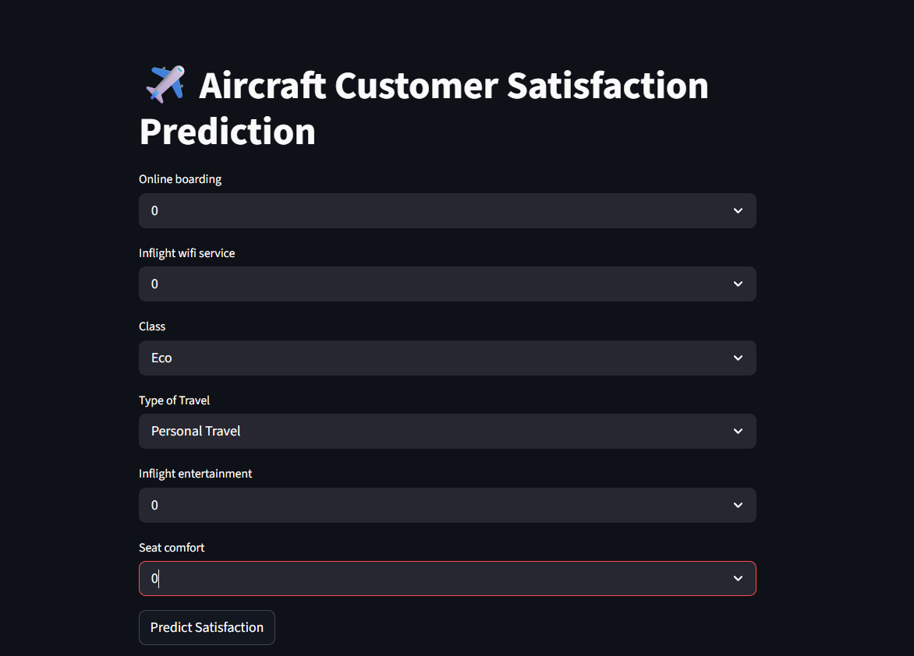

# Aircraft Customer Satisfaction Prediction using Machine Learning

A Machine Learning project that predicts whether an airline customer is **satisfied** or **dissatisfied** based on service quality, travel details, and onboard experience.

---

## Project Overview

Customer satisfaction is one of the most important factors in the airline industry. Airlines need to understand what influences passenger experience so they can improve service quality and make better business decisions.

This project analyzes airline customer data, performs exploratory data analysis, preprocesses the data, and builds machine learning models to predict customer satisfaction. The project also includes deployment of the final model using **Streamlit** and **Hugging Face Spaces**.

---

## Problem Statement

Airlines collect large volumes of customer feedback, but manually identifying the most important factors behind satisfaction is difficult.

The objective of this project is to build a **classification model** that predicts whether a customer is:

- **satisfied**
- **neutral or dissatisfied**

based on service-related and travel-related features such as:

- Inflight wifi service
- Online boarding
- Seat comfort
- Inflight entertainment
- Class
- Type of travel
- Cleanliness
- Arrival delay and other flight-related features

By predicting customer satisfaction, airlines can focus on improving the areas that most strongly affect passenger experience.

---

## Dataset Information

- **Dataset name:** `aircraft.csv`
- **Dataset shape:** `103904 rows × 25 columns`
- **Target column:** `satisfaction`
- **Target classes:**
  - `satisfied`
  - `neutral or dissatisfied`
- **Problem type:** Classification

Before modeling, unnecessary columns such as `Unnamed: 0` and `id` were removed.

---

## Tech Stack

- Python
- Pandas
- NumPy
- Matplotlib
- Seaborn
- Scikit-learn
- Streamlit
- Joblib

---

## Exploratory Data Analysis (EDA)

The dataset was explored using:

- **Univariate analysis**
  - Histograms for numerical features
  - Count plots for categorical features

- **Bivariate analysis**
  - Boxplots for numerical features vs target
  - Countplots for categorical features vs target

- **Correlation analysis**
  - Heatmap for numerical feature correlations

- **Target distribution analysis**
  - Countplot of the satisfaction classes

This helped in understanding feature behavior, relationships with the target, and overall data patterns.

---

## Preprocessing

The following preprocessing steps were performed:

1. Removed unnecessary columns:
   - `Unnamed: 0`
   - `id`

2. Converted the target column:
   - `satisfied` → `1`
   - `neutral or dissatisfied` → `0`

3. Split the data into:
   - training set
   - testing set

4. Handled missing values in:
   - `Arrival Delay in Minutes`

   Missing values were filled using the **median value from the training data** to avoid data leakage.

5. Applied preprocessing using **ColumnTransformer**:
   - **StandardScaler** for numerical columns
   - **OneHotEncoder** for categorical columns

6. Transformed both training and testing data before model training

---

## Models Used

The following machine learning models were trained and evaluated:

- Logistic Regression
- Decision Tree Classifier
- Random Forest Classifier

Among these, **Random Forest** performed best and was selected as the final model.

---

## Workflow

1. Loaded the dataset
2. Performed data cleaning
3. Conducted exploratory data analysis
4. Selected features and target
5. Split the dataset into training and testing sets
6. Handled missing values
7. Applied preprocessing using ColumnTransformer
8. Trained multiple machine learning models
9. Evaluated model performance
10. Performed hyperparameter tuning using GridSearchCV
11. Selected the best-performing model
12. Built a deployment pipeline using selected important features
13. Saved the final model pipeline using Joblib
14. Deployed the app using Streamlit and Hugging Face Spaces

---

## Model Evaluation Metrics

The models were evaluated using:

- Accuracy
- Precision
- Recall
- F1 Score
- Confusion Matrix
- Cross-validation score

---

## Results

### Best Accuracy Before Hyperparameter Tuning
- **Random Forest Test Accuracy:** `0.9616957797988547`

### Best Model After Hyperparameter Tuning
- **Best Model:** Random Forest
- **Best Parameters:**
  - `max_depth = 10`
  - `n_estimators = 50`
- **Best CV Score:** `0.9437700767800156`

### Final Observation
Random Forest performed better than Logistic Regression and Decision Tree, making it the best model for this project.

---

## Confusion Matrix

The confusion matrix for the model is:

- **True Negatives:** 11487
- **False Positives:** 289
- **False Negatives:** 507
- **True Positives:** 8498

This shows that the model performs strongly in classifying both satisfied and neutral/dissatisfied customers.

---

## Important Features Used for Deployment

For deployment, the final pipeline was built using selected important features:

- Online boarding
- Inflight wifi service
- Class
- Type of Travel
- Inflight entertainment
- Seat comfort

A separate **Pipeline** was created using:

- `ColumnTransformer`
- `OneHotEncoder`
- `RandomForestClassifier`

and saved as:

- `rf_pipeline.pkl`

---

## Project Structure

```text
Aircraft-Customer-Satisfaction/
├── app.py
├── rf_pipeline.pkl
├── requirements.txt
├── README.md
├── output.png
└── data/
    └── aircraft.csv


##  How to Run Locally

```bash
git clone https://github.com/Anjiembadi/Aircraft-Customer-Satisfaction-Using-Machine-Learning.git
cd Aircraft-Customer-Satisfaction-Using-Machine-Learning
pip install -r requirements.txt
streamlit run app.py
```

---

##  Live Demo

 Try the application here:  
 https://huggingface.co/spaces/Embadianji/Aircraft-Customer-Satisfaction  

> The application was deployed using Hugging Face Spaces with a Streamlit interface.

---

##  Screenshots

###  Application Interface



---


##  Key Insights

* Inflight service quality strongly impacts customer satisfaction
* Seat comfort is a major deciding factor
* WiFi service and online boarding experience influence passenger perception
* Entertainment and travel class also contribute significantly to customer satisfaction
* A small set of important features can still produce strong prediction performance

---

##  Future Improvements

* Try advanced boosting models such as XGBoost
* Add explainability using SHAP
* Build a REST API for real-time prediction
* Improve UI/UX of the deployed application
* Add model monitoring and versioning
* Compare performance using more feature selection techniques

---


##  Author

**Embadi Anji**

🔗 GitHub: [https://github.com/Anjiembadi](https://github.com/Anjiembadi)

🔗 LinkedIn: [https://www.linkedin.com/in/embadi-anji-31122531a](https://www.linkedin.com/in/embadi-anji-31122531a/)

---


